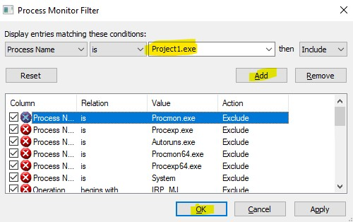

Once someone contacted me to understand an error. The error read "Run-time error '76' Path Not found". The application developer had written correct error logging and it included error message and error number. The only thing that was not logged was the path that was being accessed. Here is how the error looked like:

Diagnosing this type of problem in a large application with millions of lines of is pretty hard. In a production environment without looking at the code, finding the file which is being accessed by application is pretty hard. 
The first tool that I try when looking at a problem like this is [ProcMon](https://docs.microsoft.com/en-us/sysinternals/downloads/procmon) from Sysinternals.

The first thing I do after launching ProcMon is to disable event capturing by pressing "Ctrl+E" (by default even capturing enabled once we launch ProcMon). 
Next step is to configure ProcMon to look at the events generated by specific application. We do it by pressing "Ctrl+L" and then adding our executable to filter list. Here is a screenshot:

Now, we come back to the application. We reach up to the step which errors out, but don't perform that operation (for example, if clicking on a button throws an error, reach up to the step to be able to click on it but don't click on it). Now, come back to ProcMon and press "Ctrl+E" which will re-enable even capture. Once that is done, click on the button which throws an error in your application.
Doing this will generate a log that will look something like below:

Once you have got the error, come back to ProcMon and press "Ctrl+E" again to disable the event capture. 

At this step, we have got the ProcMon log captured. Now comes the tricky part to co-relate the application error with the entries in ProcMon.